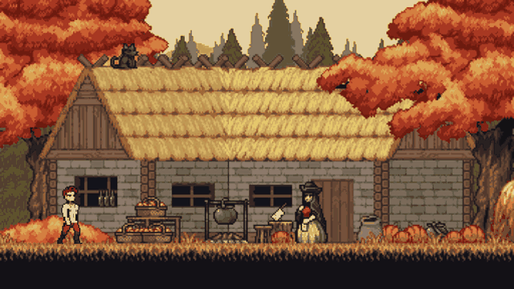
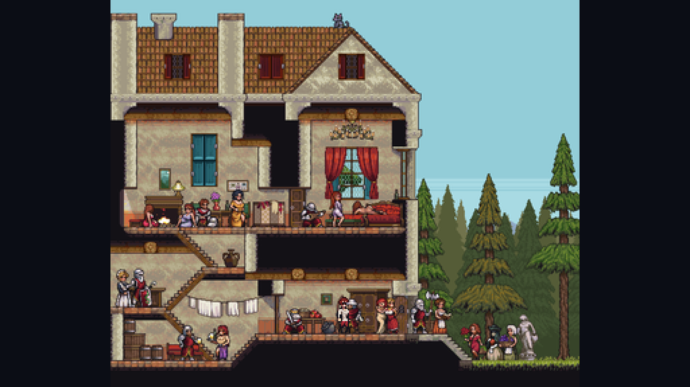
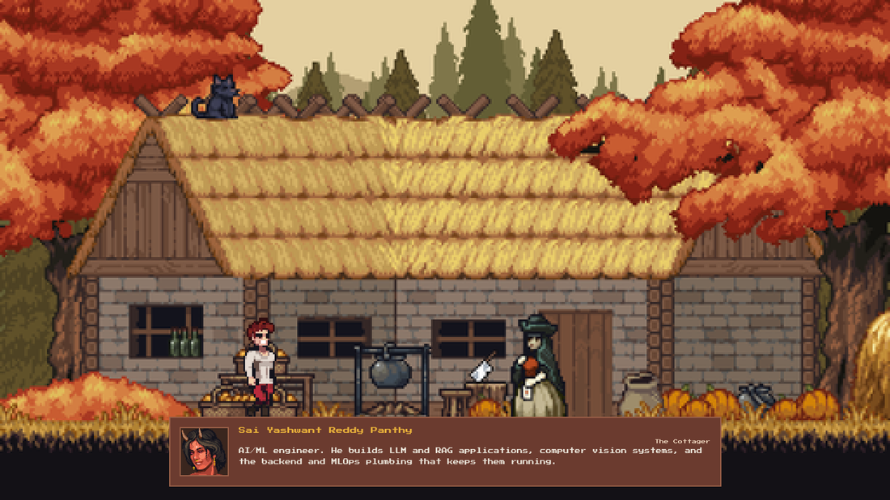
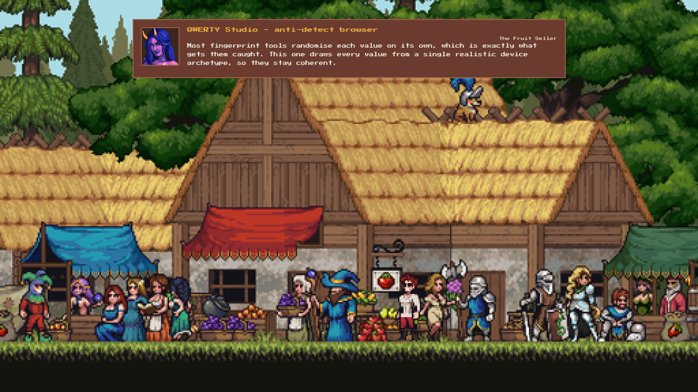
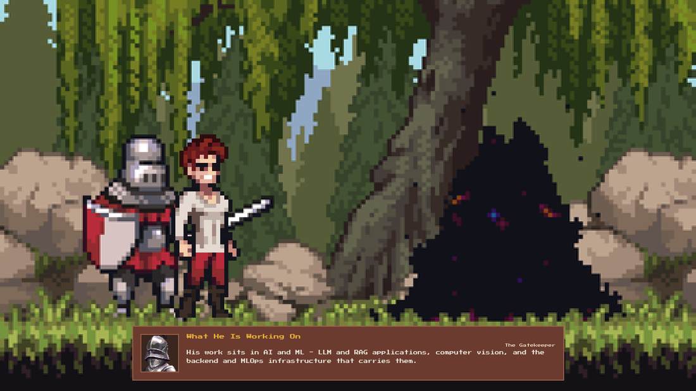

<div align="center">

# The Chosen One

### A portfolio you walk through

Two front doors onto the same material. `/` is a playable pixel-art game where the
people standing in each painted screen tell you what I have built. `/site` is the
same portfolio written down, for anyone who would rather read.

**[▶ Play it](https://my-portfolio1-rose-eight.vercel.app/)**  ·
**[Read it instead](https://my-portfolio1-rose-eight.vercel.app/site)**

[](#the-game)
[](#the-game)
[](#the-written-site)
[](https://www.typescriptlang.org/)



</div>

---

## The idea

A portfolio is usually a scroll and a PDF. This one is a short walk through nine
painted screens. Reach the edge of a screen and the world moves on. Stand near
someone and they tell you a piece of the CV — the fruit seller in the market
explains why most browser-fingerprint tools get caught, the knight at the gate
tells you what I am working on now, and there is one screen the walk never takes
you to.

Everything in the written portfolio is in the game, and the game's `Normal site`
button is one tap from the written version. Neither is a summary of the other.

| | |
|---|---|
|  |  |
| **The manor.** A cutaway house — cellar, hall, half-landing, solar — joined by a three-flight switchback staircase you walk rather than trigger. | **Harvest Cottage.** The opening screen. Every villager carries one piece of the CV and a portrait cut from the same art. |
|  |  |
| **The market.** Five stalls, five projects. The dialogue moves to the top here so the stalls are never covered. | **The gate.** Stand before it, press up, and it takes you somewhere the walk does not. |

---

## The game

No engine, no framework, no build step, no dependencies. One canvas, one script.

```
index.html      586 lines
css/style.css   829 lines
js/game.js    1 648 lines
```

Three problems that were more interesting than they looked.

### Animated backgrounds that would not animate

Browsers only advance a GIF's frames while they are painting it, so an ``
GIF drawn into a canvas freezes on frame one. The stages are decoded with the
**WebCodecs `ImageDecoder`** API instead and their frames driven off the game
clock, with an LRU cache and a per-stage memory budget that trades resolution
against frame count so a long animation never collapses into a slideshow.

### Ground that is not a function of x

Most screens are a single painted ground line. The manor is a building: the hall
runs above the cellar, the solar above the hall, and a staircase crosses both. At
one `x` there are three answers, so "the ground" stops being `y = f(x)`.

The hero remembers **which surface he is standing on** and only changes at a
segment's end. That one idea is what makes the staircase walkable instead of a
teleport — its foot and its head are endpoints, so he steps onto it there and
nowhere else, and the floors it crosses in between are simply never offered.

### Nothing guessed

Every ground line, character scale, wall and ramp was measured off the artwork at
1:1 and converted into the game's 512×288 design space. The manor's geometry was
traced from a collision map drawn over the art and converted with
`x = 82.21 + 0.31034·xᵢ`. When a hero looks like he is floating, it is arithmetic,
not taste.

### Also in there

- **Device-resolution rendering.** The canvas is backed at `viewport × devicePixelRatio`, and smoothing is chosen per draw — on when shrinking art, off when enlarging it.
- **Two fits.** Landscapes cover the frame; the manor is *contained*, because a building has to be seen whole or its upper floors are off-screen.
- **24 villagers, 24 portraits**, each bust matched to the character painted into the scene.
- **Phones.** Turn it sideways and it starts — nothing loads in portrait, because the stage is a 16:9 painting. Thumb controls sit in the bottom corners.
- **He falls asleep** if you leave him alone for six seconds, and gets up when you come back.

---

## The written site

Next.js 15 App Router with React 19, TypeScript and Tailwind. Routes for About,
Projects, Skills, Services and Contact, with the portfolio content in a single
typed data module.

`/` is rewritten onto the game's static bundle, so the game is the front door and
Next never routes `/` at all:

```ts
// next.config.ts
async rewrites() {
  return [{ source: '/', destination: '/index.html' }];
}
```

The game lives at the root of `public/` rather than a subfolder. Served through a
rewrite at `/`, the browser resolves its relative paths against `/` — from a
subfolder every asset would 404.

---

## Repository

```text
public/               the game: index.html, css/, js/, assets/  (~5 MB, 70 files)
src/app/              the written site
  ├── site/           its home page, at /site
  ├── about|projects|skills|services|contact/
  └── data/           all portfolio content, typed
src/components/       UI components
docs/game/            the images in this README
next.config.ts        the rewrite that puts the game at /
```

## Running it

```bash
npm install
npm run dev          # http://localhost:9002
```

The game is static — `public/index.html` opens on its own with any file server,
no build required.

## Credits

Pixel art by **[GandalfHardcore](https://gandalfhardcore.itch.io/)**. The stage
backgrounds were assembled from his asset packs; the sprite sheets, portraits and
tilesets are his work, used under the pack licence. Everything else — the engine,
the geometry, the site — is mine.

---

<div align="center">

**[Sai Yashwant Reddy Panthy](https://linkedin.com/in/saiyashwantreddy)** ·
AI & Machine Learning Engineer

[GitHub](https://github.com/champion19007) ·
[LinkedIn](https://linkedin.com/in/saiyashwantreddy)

</div>
