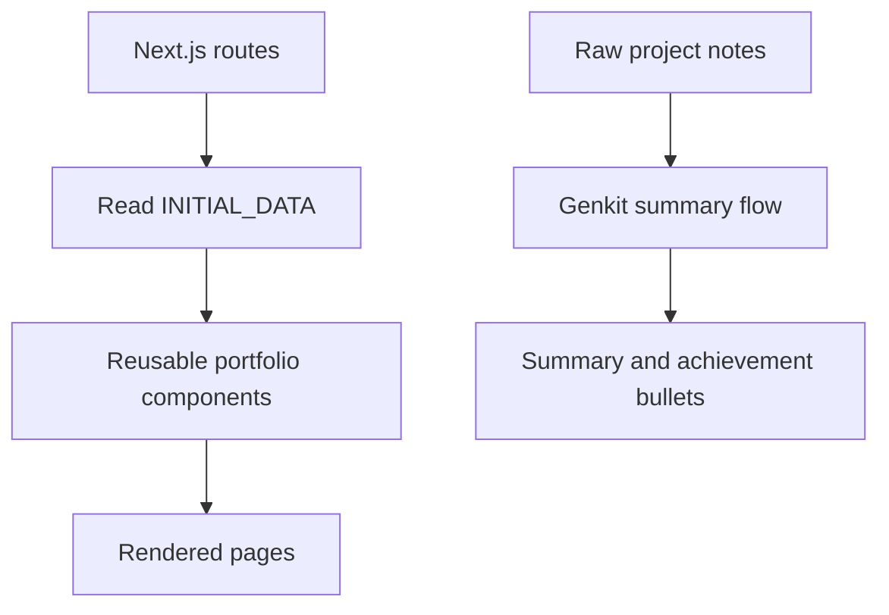

<div align="center">

# Sai Yashwant Reddy Panthy
### AI & Machine Learning Engineer · RAG · MLOps · Computer Vision

A personal portfolio showcasing my engineering projects, research, experience, and technical interests.

[](https://nextjs.org/)
[](https://react.dev/)
[](https://www.typescriptlang.org/)
[](https://tailwindcss.com/)
[](https://genkit.dev/)

[Portfolio](https://saiyashwantreddy.web.app) · [GitHub](https://github.com/champion19007) · [LinkedIn](https://linkedin.com/in/saiyashwantreddy)

</div>

---

## About

This repository contains my personal portfolio website. It presents selected work across AI/ML, data science, computer vision, and MLOps, alongside my background, research, and ways to connect.

The site is built with Next.js and React. Portfolio content is organized in a typed data module, while reusable components render the main sections. It also includes a Genkit-powered project-summary flow intended to turn rough project notes into a concise summary and achievement bullets.

> **Note:** Project descriptions and achievements on a portfolio should be checked against the corresponding implementation and supporting evidence. A project card does not by itself imply that a linked project is deployed or production-ready.

## Preview

<!-- Add current screenshots to the repository under docs/images/ and update these paths when available. -->

| Home | Projects |
|---|---|
|  |  |

| About | Contact |
|---|---|
|  |  |

*If the screenshots are not present yet, capture the current site at desktop and mobile widths, save the images in `docs/images/`, and keep the paths above in sync.*

## Features

- **Portfolio sections:** Home, About, Projects, and Contact routes.
- **Structured content:** profile, education, experience, research, projects, skills, and offerings are maintained in a central typed data object.
- **Project cards:** show project descriptions, technology tags, images, and repository or live-demo links when provided.
- **AI project-summary flow:** accepts project notes and requests a structured summary plus achievement bullets through Genkit.
- **Responsive styling:** Tailwind-based layout with reusable UI components.
- **Metadata:** page metadata and social-sharing metadata are configured in the Next.js app.
- **Firebase-related setup:** repository includes Firebase configuration files for the hosting/deployment setup.

## Tech stack

| Technology | Role |
|---|---|
| Next.js 15, React 19 | Application framework and UI |
| TypeScript | Typed application and portfolio data |
| Tailwind CSS | Styling and responsive layout |
| Radix UI / reusable UI components | Accessible interface primitives |
| Framer Motion | UI motion and transitions |
| Lucide React | Icons |
| Genkit + Google GenAI integration | AI project-summary generation |
| Firebase configuration | Hosting/deployment-related configuration |

## Application structure

```text
src/
├── app/
│   ├── about/          # About page
│   ├── contact/        # Contact page
│   ├── data/           # Central portfolio content
│   ├── projects/       # Projects page
│   ├── site/           # Main portfolio landing page
│   ├── skills/         # Skills route
│   ├── services/       # Services route
│   ├── lib/             # App utilities and local data helpers
│   └── types/           # Shared TypeScript types
├── ai/
│   ├── dev.ts           # Genkit development entry point
│   └── flows/           # AI generation flows
└── components/
    └── portfolio/       # Portfolio-specific UI components
```

### High-level rendering flow



## Run locally

### Requirements

- Node.js compatible with the installed Next.js version
- npm
- A Google GenAI/Genkit credential if you want to run the AI generation flow

### Install and start

```bash
git clone https://github.com/champion19007/my-portfolio1.git
cd my-portfolio1
npm install
npm run dev
```

The development script starts Next.js on port **9002**. Open [http://localhost:9002](http://localhost:9002).

### AI flow development server

The repository provides these scripts:

```bash
npm run genkit:dev
# or, to watch for changes
npm run genkit:watch
```

Configure the environment variables required by the Genkit Google GenAI integration before using the AI feature. Do not commit API keys or other secrets. Check the current Genkit/provider documentation and project configuration for the exact variable names expected by your setup.

### Available scripts

| Command | Purpose |
|---|---|
| `npm run dev` | Start the Next.js development server on port 9002 |
| `npm run genkit:dev` | Start the Genkit development process |
| `npm run genkit:watch` | Start Genkit with watch mode |
| `npm run build` | Create a production build |
| `npm run start` | Start the production server |
| `npm run lint` | Run the configured lint command |
| `npm run typecheck` | Run TypeScript without emitting files |

> Build and lint scripts can be environment- and framework-version-sensitive. If a command fails in your environment, check the installed Node/npm versions and the script configuration rather than assuming the application itself is broken.

## Portfolio content

Most portfolio content is maintained in:

```text
src/app/data/initial-data.ts
```

This includes profile information, education, experience, research, project cards, skills, and service descriptions. Update the data there when changing the portfolio content, and ensure claims and dates remain accurate.

## Deployment

The repository includes Firebase and App Hosting configuration files. The production deployment should be considered verified only after a successful deployment and a manual check of the live routes, assets, and AI-related behavior. The configured public portfolio URL is:

**https://saiyashwantreddy.web.app**

## Current scope and limitations

- Portfolio content is currently represented as code-based data rather than a demonstrated owner-managed CMS.
- The contact page presents direct contact methods; this README does not claim that a server-backed contact submission system is implemented.
- The AI summary flow generates draft content. Review and fact-check its output before publishing it.
- Project links may point to separate repositories; each project’s maturity and deployment status should be assessed independently.
- Screenshots in the Preview section are expected at `docs/images/`. Add the images or adjust those paths to match the actual screenshot filenames.

## Roadmap

- [ ] Add verified desktop and mobile screenshots.
- [ ] Add detailed project case-study pages with architecture diagrams, contributions, trade-offs, and evidence-backed results.
- [ ] Add automated unit, integration, and end-to-end tests.
- [ ] Add CI checks for linting, type-checking, tests, and production builds.
- [ ] Complete accessibility, responsive, and performance audits.
- [ ] Confirm the root URL and all navigation routes behave as intended.

## Connect

- **Portfolio:** [saiyashwantreddy.web.app](https://saiyashwantreddy.web.app)
- **GitHub:** [@champion19007](https://github.com/champion19007)
- **LinkedIn:** [Sai Yashwant Reddy](https://linkedin.com/in/saiyashwantreddy)
- **Email:** [saiyashwantreddypanthy@gmail.com](mailto:saiyashwantreddypanthy@gmail.com)

---

<div align="center">
  <sub>Built with Next.js, React, TypeScript, and Genkit.</sub>
</div>
