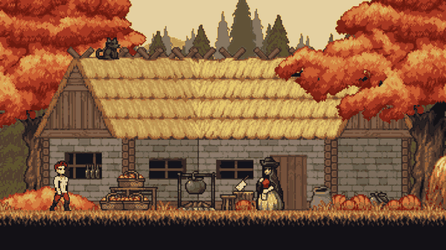
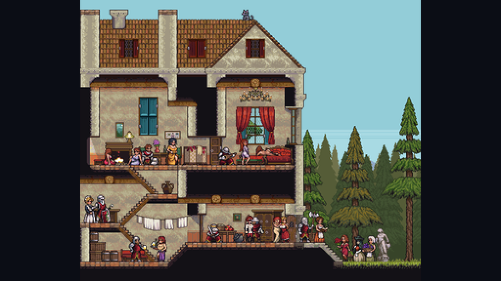
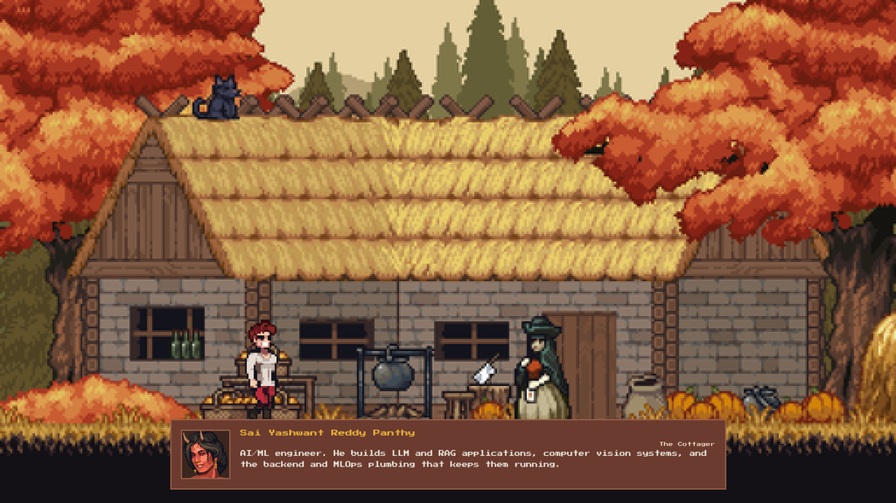
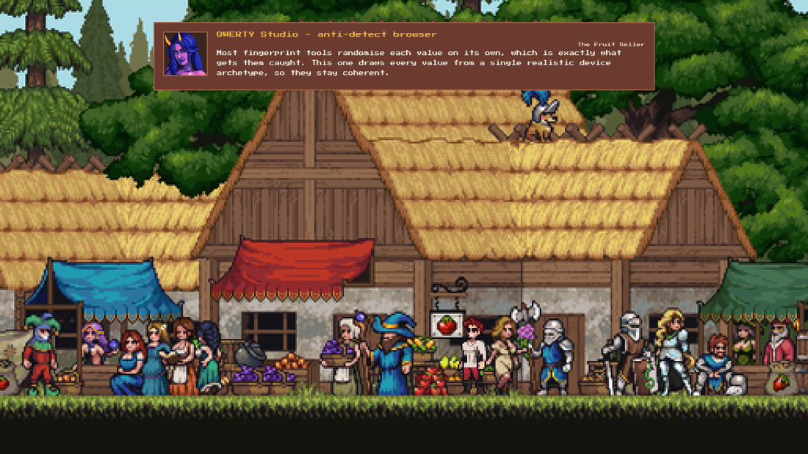
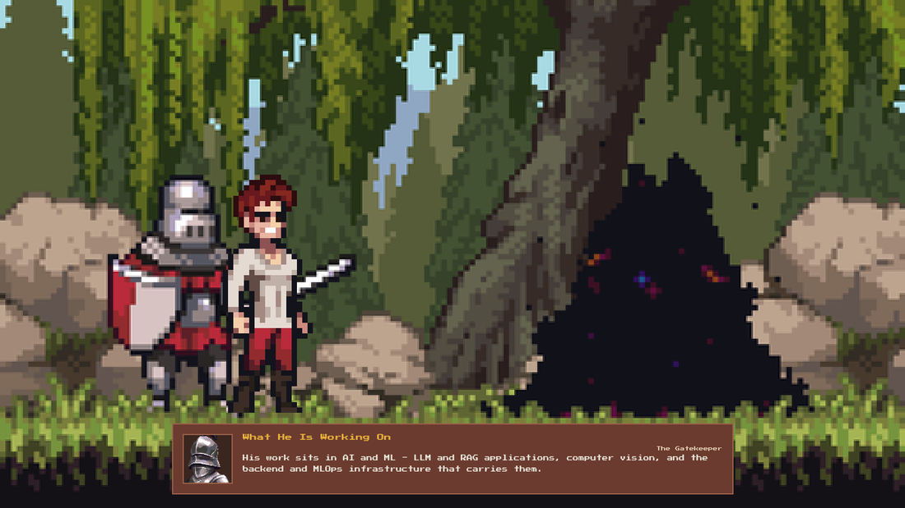

<div align="center">

# The Chosen One

### A portfolio you walk through

Two front doors onto the same material. `/` is a playable pixel-art game where the
people standing in each painted screen tell you what I have built. `/site` is the
same portfolio written down, for anyone who would rather read.

**[▶ Play it](https://my-portfolio1-rose-eight.vercel.app/)**  ·
**[Read it instead](https://my-portfolio1-rose-eight.vercel.app/site)**

[](#the-game)
[](#the-game)
[](#the-written-site)
[](https://www.typescriptlang.org/)



</div>

---

## The idea

A portfolio is usually a scroll and a PDF. This one is a short walk through nine
painted screens. Reach the edge of a screen and the world moves on. Stand near
someone and they tell you a piece of the CV — the fruit seller in the market
explains why most browser-fingerprint tools get caught, the knight at the gate
tells you what I am working on now, and there is one screen the walk never takes
you to.

Everything in the written portfolio is in the game, and the two link to each
other: the game's `Normal site` button, and a floating `Game World` pill in the
corner of the written site. Neither is a summary of the other.

| | |
|---|---|
|  |  |
| **The manor.** A cutaway house — cellar, hall, half-landing, solar — joined by a three-flight switchback staircase you walk rather than trigger. | **Harvest Cottage.** The opening screen. Every villager carries one piece of the CV and a portrait cut from the same art. |
|  |  |
| **The market.** Five stalls, five projects. The dialogue moves to the top here so the stalls are never covered. | **The gate.** Stand before it, press down, and it takes you somewhere the walk does not. |

---

## The game

No engine, no framework, no build step, no dependencies. One canvas, one script.

```
index.html        620 lines
css/style.css   1 044 lines
js/game.js      1 962 lines
js/gifdec.js      194 lines   a GIF decoder, because Safari has none
```

Four problems that were more interesting than they looked.

### Animated backgrounds that would not animate

Browsers only advance a GIF's frames while they are painting it, so an ``
GIF drawn into a canvas freezes on frame one. The stages are decoded instead and
their frames driven off the game clock.

**Safari has no `ImageDecoder` at all**, so `js/gifdec.js` is a GIF decoder
written by hand — LZW, global and local colour tables, the interlaced four-pass
row order, disposal methods 1 to 3. It is a generator over a single reused frame
buffer: holding all 163 frames as it decoded them peaked at 285 MB, and streaming
them peaks at 6. Its output was checked frame-by-frame against Pillow for all 163
frames across the nine stages and is byte-identical.

### Every frame, decoded before you play

The first version decoded three stages at a time, evicted them with an LRU and
re-decoded them on the walk back. That put a second of main-thread work in the
middle of the game, felt as everything stuttering at once — the walk, the
dialogue box, the portrait.

Worse, the memory budget was spent on **resolution first**, with the frame count
taking whatever was left. The largest stage, forty frames of 1880×950, was being
kept as **fourteen frames** — every third one, each held three times as long.

So the frame count is no longer the variable; resolution is. Every stage keeps
100% of its frames. One scale is solved against a memory budget by bisection and
applied to each stage's native size, with a floor at the design width — no sense
holding fewer source pixels than the game draws with — and a ceiling past which
no window shows the difference.

| measured in the browser | |
|---|---|
| stages resident | 9 of 9, nothing ever evicted |
| frames | 163, every one |
| memory | 143 MB against a 150 MB budget |
| largest stage | 40 frames at 889×449 |
| decode, WebCodecs | **2.25 s** |
| decode, hand-rolled | **10.2 s** |

That gap is why the loading screen behaves differently on the two paths. Where
decoding is fast it waits for all of it — and 2.25 s fits inside the 3 400 ms
first-visit floor that was already there, so nobody waits longer than before.
Where it is slow, ten seconds here is twenty to thirty on a phone, which is not a
loading screen but a hang: it waits for the first two stages and the rest land
behind the menu, in walk order, several stages ahead of walking pace.

### Ground that is not a function of x

Most screens are a single painted ground line. The manor is a building: the hall
runs above the cellar, the solar above the hall, and a staircase crosses both. At
one `x` there are three answers, so "the ground" stops being `y = f(x)`.

The hero remembers **which surface he is standing on** and only changes at a
segment's end. That one idea is what makes the staircase walkable instead of a
teleport — its foot and its head are endpoints, so he steps onto it there and
nowhere else, and the floors it crosses in between are simply never offered.

### Nothing guessed

Every ground line, character scale, wall and ramp was measured off the artwork at
1:1 and converted into the game's 512×288 design space. The manor's geometry was
traced from a collision map drawn over the art and converted with
`x = 82.21 + 0.31034·xᵢ`. When a hero looks like he is floating, it is arithmetic,
not taste.

### Also in there

- **Device-resolution rendering.** The canvas is backed at `viewport × devicePixelRatio`, and smoothing is chosen per draw — on when shrinking art, off when enlarging it.
- **Two fits.** Landscapes cover the frame; the manor is *contained*, because a building has to be seen whole or its upper floors are off-screen.
- **24 villagers, 24 portraits**, each bust matched to the character painted into the scene, each feathered so none ends on a cut edge. They preload with everything else — fetching them when somebody spoke meant the box opened, the text was there, and the face landed a beat later and shoved it sideways.
- **Phones.** Turn it sideways and it starts — nothing loads in portrait, because the stage is a 16:9 painting. Four thumb controls: `▼` talks to people and steps through gates, `▲` jumps.
- **iOS text inflation.** Safari silently enlarges text per block by how much a block holds. It is invisible in emulation and is beaten only by `text-size-adjust: 100%`.
- **He falls asleep** if you leave him alone for six seconds, and gets up when you come back.

---

## The written site

<table>
<tr>
<td width="62%"></td>
<td width="38%"></td>
</tr>
<tr>
<td><b>Dark.</b> Both themes live in one document as <code>#portfolio-dark</code> and <code>#portfolio-light</code>, and only one is displayed. The <code>Game World</code> pill in the corner is the way back.</td>
<td><b>Light, on a phone.</b> One pill, correct in both themes without a line of new colour — it reuses the floating class, which is already defined per theme.</td>
</tr>
</table>

### 20 MB of video that nobody asked for

The page arrived at **20 287 KB**, and **20 284 KB of it was video**. The HTML,
CSS and JS were never the problem — `domContentLoaded` was already 496 ms. Three
causes, and they compound:

- Every `<video>` carried `autoplay`, and **autoplay downloads the whole file regardless of what `preload` says**. `preload="metadata"` on all nine bought nothing.
- The page holds both themes and displays one. `display: none` does not stop a video loading, so every visitor also paid for the theme they were not looking at — about 8 MB.
- Six of the nine are below the fold.

The markup carries `data-src` and no `autoplay` now, and `media-lazy.js` decides
when to put them back. **On a phone: 20 287 KB → 18 KB on first paint**, with
videos restored as they come near the viewport.

On a desktop that deferral is the thing you *feel* — you scroll, and the section
you arrive at is still buffering. That reasoning is about a phone's data plan, so
a desktop takes all nine at load instead, one at a time: nine parallel downloads
share one pipe and the hero, the only one anybody is looking at yet, would finish
last instead of first.

> Not `IntersectionObserver`, which looks like the obvious tool and quietly does
> nothing here. A `<video>` with no `src` has no intrinsic size, so the CSS
> collapses it — the hero measured `0 × 0` — and **a zero-area element never
> intersects anything**. The first version loaded nothing at all, hero included.
> It measures geometry on a debounced scroll instead, taking the position from
> the nearest ancestor that actually has a box.

### On a phone

Checked at 320, 375 and 430 in both themes: horizontal overflow **0** at every
width, every tap target **≥ 44 px**, no text under **12 px**. The mono
micro-labels are 10 and 11 px, which is right on a desktop — they are captions
and figure numbers — but two of them are not captions at all, so they get a floor
below 520 px and keep their original size above it.

### Routing

`/` is rewritten onto the game's static bundle, so the game is the front door and
Next never routes `/` at all:

```ts
// next.config.ts
async rewrites() {
  return [{ source: '/', destination: '/index.html' }];
}
```

The game lives at the root of `public/` rather than a subfolder. Served through a
rewrite at `/`, the browser resolves its relative paths against `/` — from a
subfolder every asset would 404.

`/site` is a **redirect** to `/site/index.html`, not a rewrite. Its assets are
addressed relatively, so a rewrite would leave the address bar on `/site`, which
a browser reads as a file, and every asset would then be looked for at the site
root.

| route | what it is |
|---|---|
| `/` | the game |
| `/site` | the written portfolio |
| `/v1` | an earlier Next rebuild of the written site, kept |
| `/v2` | redirects to `/site` |

---

## Repository

```text
public/                   the game: index.html, css/, js/, assets/
  ├── js/gifdec.js        hand-written GIF decoder, for Safari
  ├── js/prefetch-site.js warms the written site while the game is idle
  └── site/               the written portfolio  (39 files, 25 MB)
src/app/                  Next routes
  ├── v1/                 the earlier rebuild
  └── data/               portfolio content, typed
src/components/site/      the rebuild's components
docs/game/, docs/site/    the images in this README
next.config.ts            the rewrite, the redirects, the cache headers
```

## Running it

```bash
npm install
npm run dev          # http://localhost:9002
```

The game is static — `public/index.html` opens on its own with any file server,
no build required. So does `public/site/index.html`.

## Credits

Pixel art by **[GandalfHardcore](https://gandalfhardcore.itch.io/)**. The stage
backgrounds were assembled from his asset packs; the sprite sheets, portraits and
tilesets are his work, used under the pack licence. Everything else — the engine,
the geometry, the site — is mine.

---

<div align="center">

**[Sai Yashwant Reddy Panthy](https://linkedin.com/in/saiyashwantreddy)** ·
AI & Machine Learning Engineer

[GitHub](https://github.com/champion19007) ·
[LinkedIn](https://linkedin.com/in/saiyashwantreddy) ·
[Book a call](https://cal.com/sai-yashwant-reddy-panthy-m6bfa9)

</div>
